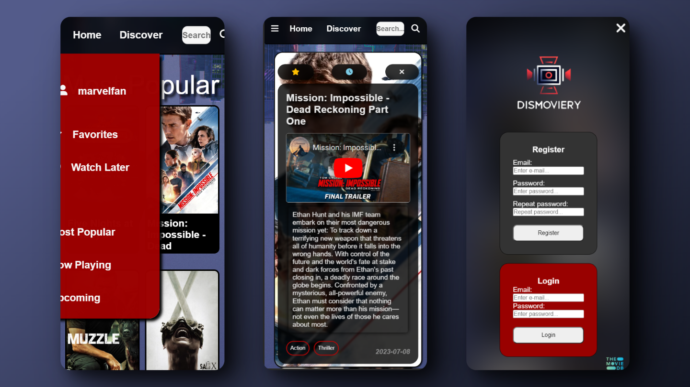

# Dismoviery Website
[Dismoviery Website](https://axelothleohryn.github.io/dismoviery-website/ "Dismoviery Website")

Personal Frontend Project using HTML, CSS, and JS, built with mobile-first principles.

Dismoviery is a dynamic web application that allows users to search for movies, filter results, and discover new favorites. Leveraging the TMDB API, the site offers a rich user experience with features like user authentication, personalized watchlists, and detailed movie information.

- Dynamic DOM manipulation.
- ES6
- HTTP requests to an external API (TMDB API)
- Usage of Firebase Authentication and Firestore

## Key Features

### Main Page: Most Popular, Playing Now, Upcoming
The main page features the most interesting lists of movies for the user, available at a quick glance.

### Basic Search
Sort and search movies using various criteria.

### Discover
Utilize filters like genre, release year, and more to find new movies.

The purpose of this feature is to explore and discover new movies and play around with the different criteria.

### User login and authentication
Secure login and registration with Firebase Auth. 

### Personalized Lists by user
Save movies to Favorites or Watch Later lists. 

### Movie details
Open any movie card to display in-depth details with trailers, synopsis, and user interaction.

### Mobile-first Design

The design approach starts with the mobile experience first, ensuring optimal usability and engagement on smaller screens. I prioritize content and functionality that are essential for on-the-go users, leading to a clean and intuitive interface on mobile devices. This mobile-first strategy also lays a solid foundation for scaling up to larger screens with a consistent user experience.

Here's how Dismoviery looks on mobile devices versus desktops:

Mobile View             |  Desktop View
:-------------------------:|:-------------------------:
  |  

By focusing on mobile, we ensure that the website is accessible to the widest possible audience, providing a seamless experience across all devices.

## Technologies Used

- HTML5
- CSS3
- JavaScript
- Firebase

### Project Management

I utilized Trello for managing my project's tasks and timelines efficiently. Below is a snapshot of my Trello board mid-development:

